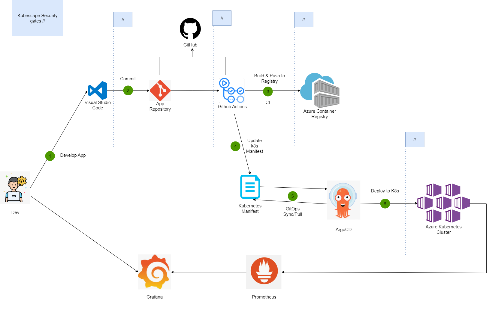

# Basic CI/CD Pipeline with Github Actions and ArgoCD



## Table of Contents
- [Description](#description)
- [Tools](#tools)
- [Installation](#installation)

## Description
This project demonstrates using Kubescape as a secure gate in the CI/CD pipeline.

## Tools
- Azure Kubernetes Service
- Azure Container Registry
- Github Actions
- ArgoCD

## Installation

### Steps
1. **Fork the repository:**
    ```bash
    git clone https://github.com/baolonggg/TestingCICD.git
    ```
2. **Create AKS and ACR in one Resource Group.**

3. **Set up secret variables to connect Azure and Github:**
    ```bash
    AZURE_CLIENT_ID = <your_client_id>
    AZURE_TENANT_ID = <your_tenant_id>
    AZURE_SUBSCRIPTION_ID = <your_subscription_id>
    ```

4. **Install ArgoCD on your AKS Cluster by following [these steps](https://argo-cd.readthedocs.io/en/stable/getting_started/).**

5. **Run the workflow to deploy the microservice app using GitOps.**

6. **Deploy to AKS:**
    - **Create a new Application in ArgoCD.**
    - **Application Name:** Microservice App
        - **Project Name:** default
        - **Sync Policy:** Automatic
        - **Source:**
            - **Repository URL:** [https://github.com/YOURREPO/TestingCICD.git](https://github.com/YOURREPO/TestingCICD.git)
            - **Revision:** HEAD
            - **Path:** workloads/src or workloads/src2
        - **Destination:**
            - **Cluster URL:** [https://kubernetes.default.svc](https://kubernetes.default.svc)
            - **Namespace:** default

7. **Deploy Successfully**